### 性能指标工具React Perf
React 官方为我们提供的性能指标工具 Perf (只适用于开发模式)

我们有两种方式使用它

ps:两种方式都需要在项目[Perf](https://facebook.github.io/react/docs/perf.html)插件
```js
import Perf from 'react-addons-perf' // ES6
var Perf = require('react-addons-perf') // ES5 with npm
var Perf = React.addons.Perf; // ES5 with react-with-addons.js
```

#### 1.下载 [Perf 插件](https://chrome.google.com/webstore/detail/react-perf/hacmcodfllhbnekmghgdlplbdnahmhmm)

在控制台中直接操作

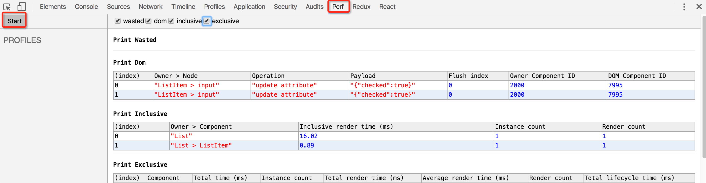

#### 2.利用 Perf 提供的工具函数

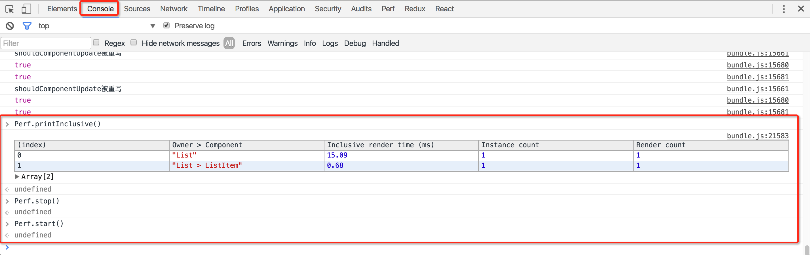

### 先看一个例子

```js
class Son extends React.Component {
  constructor(props) {
    super(props);
  }
  render() {
    console.log("我也render了");
    return (
      <div>hello world~</div>
    );
  }
}

class Dad extends React.Component {
  constructor(props) {
    super(props);
    this.state = {count: 1};
  }

  render() {
    console.log("我render了!");
    return (
      <div>
        <Son></Son>
        <button
          onClick={() => this.setState(state => ({count: state.count + 1}))}>
          Count: {this.state.count}
        </button>
      </div>
    );
  }
}

 ReactDOM.render(<Dad />, document.getElementById('container'))
```


打开控制台，可以看到这样的效果，按下按钮后，Son 组件每次都会重新 render ，然而对于我们来说，Son 组件是没有变化的，是不需要重新 render 的


最优的情况是我们只希望重新渲染需要的部分，但事实看来并非如此

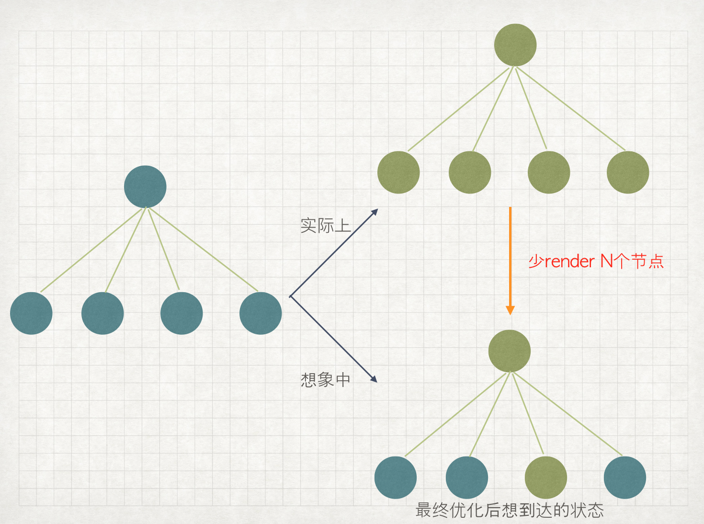

### 思考：这种情况发生的原因是什么？

我们可以在React代码中找到shouldComponentUpdate的部分

```js
shouldComponentUpdate: function(nextProps, nextState) {
  return true;
}
```

结合下图，的出这样的信息：组件重新渲染之前调用shouldComponentUpdate，判断组件的props和state，若其中一者变化，函数返回trus,根据diff算法的结果进行rerender；都没有变化，就返回false，表示不需要渲染从代码看来，shouldComponentUpdate默认返回true，这就造成了不需要重新渲染的组件也会渲染的情况

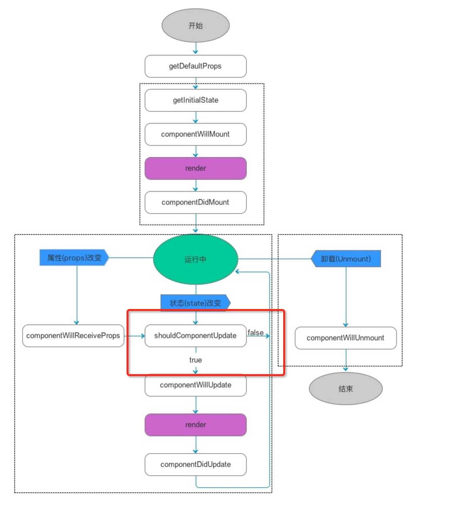

继续看代码，找到执行 props 和 state 对比的地方

```js
if (inst.shouldComponentUpdate) {
    //如果shouldComponentUpdate方法被重写
    if (process.env.NODE_ENV !== 'production') {
        shouldUpdate = measureLifeCyclePerf(function () {
            return inst.shouldComponentUpdate(nextProps, nextState, nextContext);
        }, this._debugID, 'shouldComponentUpdate');
    } else {
        shouldUpdate = inst.shouldComponentUpdate(nextProps, nextState, nextContext);
    }
} else {
    //如果没有重写，利用shallowEqual函数进行对比工作
    if (this._compositeType === CompositeTypes.PureClass) {
        shouldUpdate = !shallowEqual(prevProps, nextProps) || !shallowEqual(inst.state, nextState);
    }
}
```

shallowEqual 实际上来自这里 [shallowEqual源码](https://github.com/facebook/fbjs/blob/master/packages/fbjs/src/core/shallowEqual.js)

代码如下

```js
//是不是绝对的相等
function is(x: mixed, y: mixed): boolean {
  // SameValue algorithm
  if (x === y) { // Steps 1-5, 7-10
    // Steps 6.b-6.e: +0 != -0
    // Added the nonzero y check to make Flow happy, but it is redundant
    return x !== 0 || y !== 0 || 1 / x === 1 / y;
  } else {
    // Step 6.a: NaN == NaN
    return x !== x && y !== y;
  }
}


function shallowEqual(objA: mixed, objB: mixed): boolean {
//如果是绝对的相等，返回true
  if (is(objA, objB)) {
    return true;
  }
//带比较的二者是null或者类型不是对象，返回false
  if (typeof objA !== 'object' || objA === null ||
      typeof objB !== 'object' || objB === null) {
    return false;
  }
 //以下为处理对象的部分
  const keysA = Object.keys(objA);
  const keysB = Object.keys(objB);
//比较对象的key数组长度,不同，返回false
  if (keysA.length !== keysB.length) {
    return false;
  }
//可以看到，在比较对象A和对象B的时候，只比较的对象的第一层的相等情况，也就是说，对于复杂的嵌套是无法返回正确的结果的
  // Test for A's keys different from B.
  for (let i = 0; i < keysA.length; i++) {
    if (
      !hasOwnProperty.call(objB, keysA[i]) ||
      !is(objA[keysA[i]], objB[keysA[i]])
    ) {
      return false;
    }
  }

  return true;
}

module.exports = shallowEqual;
```

可以看出，shallowEqual 实际上是一个“浅比较”，也就是说，在 props 或者 state 是多层嵌套的复杂的对象，会给出错误的结果，这就可能导致应该重新渲染的部分没有渲染的问题

### 得出优化思路

根据以上的结论，我们想要减少无用的渲染次数，可以在如何让 shouldComponentUpdate 在无需重新渲染时返回值为 false 上下手

### 从一个稍复杂的例子下手

```js
import React from 'react';

class List extends React.Component{
    constructor(props) {
        super(props);
        // 构造一个2000个数据的数组
        let dataArr = [];
        for(let i = 0; i < 2000; i++){
            let checked = Math.random() < 0.5;
            dataArr.push({
                name: i,
                checked: checked
            });
        }
        this.state = {
            list: dataArr
        };

        this.toggleChecked = this.toggleChecked.bind(this);
    }

    // 对数据的状态进行变更
    toggleChecked(event) {
        let checked = event.target.checked;
        let index = event.target.getAttribute("data-index");
        let list = this.state.list;
        list[index].checked = checked;

            this.setState({list});
        }

    render(){
        console.log("我render了！");
        // 将数组的数据渲染出来
        return (
            <ul>
                {this.state.list.map((data, index)=>{
                    return (
                        <ListItem data={data}
                            index={index} key={data.name}
                            toggleChecked={this.toggleChecked}
                        />
                    )
                })}
            </ul>
        )
    }
 };
// 代表每一个子组件
class ListItem extends React.Component{
    constructor(props) {
      super(props);
    }

    render() {
        let data = this.props.data;
        let index = this.props.index;

        console.log("编号" + index + "render了");

        // checkbox选择框是一个受限组件，用数据来决定它是否选中
        return (
            <li>
                <input type="checkbox" key={index}
                        data-index={index}           
                        checked={data.checked}
                        onChange={this.props.toggleChecked}/>
                <span>{index}</span>
            </li>
        );
    }
};

export default List;

```

一个有2000个 checkbox 的列表，props 和 state 中有较为复杂的对象

我们用这个例子来做性能优化实验

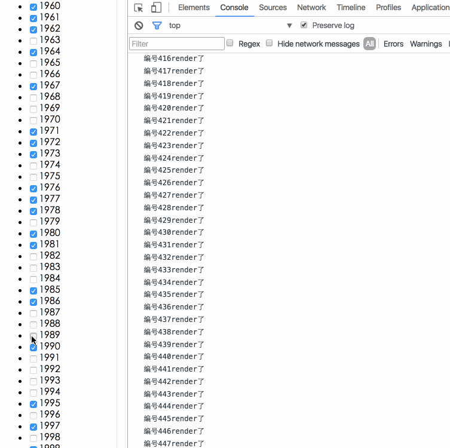

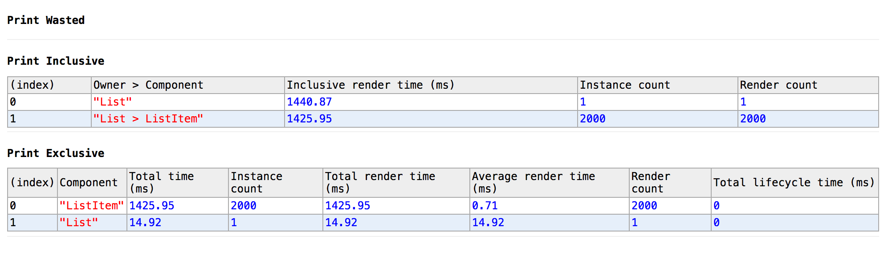

优化前的效果

最优的情况，只有被点击的1989号被重新渲染

### 方法一：shuoldComponentUpdate + 深拷贝

现在试着利用 shuoldComponentUpdate 进行优化

加入以下代码

```js
shouldComponentUpdate(nextProps) {
    return this.props.data.checked !== nextProps.data.checked;
}
```

加入后运行 点击编号1989的 checkbook ，发现并没有重新渲染1989号节点，试着把 this.props 和 nextprops 打印出来看看

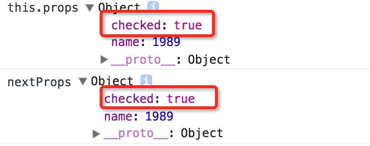

看到改变前和改变后是一样的，出现这种情况，可能是常见的引用类型引起的问题，每一次改动都是同一指针指向同一内存，数据改变是同步的。我们可以用深拷贝的方式解决这个问题

```js
let list = JSON.parse(JSON.stringify(this.state.list));
```

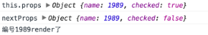

果然，深拷贝结合 shouldComponentUpdate 能够帮助我们解决问题，这样，就只有被点击的节点重新 render 了，看一下 perf 中的数据

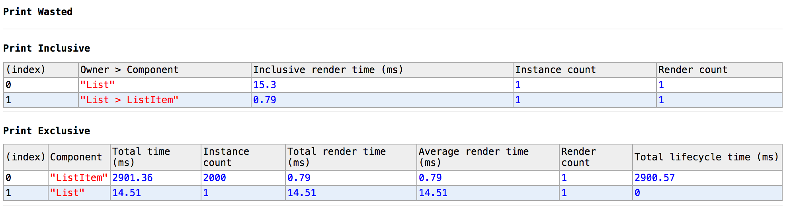

大幅度的减少了无用的渲染次数

### 方法二：shuoldComponentUpdate + Immutable.js

React 官方为我们提供的[性能优化方案](http://reactjs.cn/react/docs/advanced-performance.html)中，有一项是在项目中接入 Immutable.js。

Immutable.js 是什么，我们能用它来做什么呢？

[Immutable-js](https://github.com/facebook/immutable-js)是一个由Lee Byron编写的Javascript的数据类型库，现在已经被Facebook开源了。它通过 结构共享 的方式提供了一个 持久不可变的 的集合。让我们来看看这个到底是什么东西。

- 不可变：一旦被创建，一个集合不能被其他内容所改变
- 持久性：新的集合可以由之前的集合创建出来，或者由一个可变的数据创建。当新的集合被创建出来，原始的集合依然有效。
- 结构共享：新的集合会尽可能的复用之前集合内的内容。减少重复复制来提高性能。如果新集合和原来的集合是相等的，则会直接把之前的集合返回给新集合。

不可变的特性让跟踪变化变得简单；每次改变总是会产生新的一个对象，所以。我们只需要判断一下它们引用是否相同即可。举个例子，下面是常规的Javascript的写法：
```js
var x = { foo: "bar" };
var y = x;
y.foo = "baz";
x === y; // true
```

尽管y已经被更改了，但是它的引用还是和x是一致的。所以他们两个进行对比，始终会返回true。所以，这样的操作应该要用immutable-js来完成：

```js
var SomeRecord = Immutable.Record({ foo: null });
var x = new SomeRecord({ foo: 'bar'  });
var y = x.set('foo', 'baz');
x === y; // false
```

在这样的情况中，当我们改变了x里的内容，会返回给我们一个新的引用，我们可以安全地假定x已经改变。

以上是摘自React文档的内容,也就是说，每次我们利用Immutable生成的数据都是新的

根据这种情况 修改代码如下

```js
import React from 'react';

class List extends React.Component{
    constructor(props) {
        super(props);
        // 构造一个2000个数据的数组
        let dataArr = [];
        for(let i = 0; i < 2000; i++){
            let checked = Math.random() < 0.5;
            dataArr.push({
                name: i,
                checked: checked
            });
        }
        this.state = {
            list: Immutable.fromJS(dataArr)
        };
        this.toggleChecked = this.toggleChecked.bind(this);
    }

    // 对数据的状态进行变更
    toggleChecked(event) {
        let checked = event.target.checked;
        let index = event.target.getAttribute("data-index");
        let list = this.state.list.setIn([index, "checked"], checked);
        this.setState({list});
    }

    render(){
        console.log("我render了！");
        // 将数组的数据渲染出来
        return (
            <ul>
                {this.state.list.map((data, index)=>{
                    return (
                        <ListItem data={data}
                            index={index} key={data.name}
                            toggleChecked={this.toggleChecked}
                        />
                    )
                })}
            </ul>
        )
    }
};

// 代表每一个子组件
class ListItem extends React.Component{
    constructor(props) {
      super(props);
    }

    shouldComponentUpdate(nextProps) {
        return this.props.data !== nextProps.data;
    }

    render() {
        let data = this.props.data;
        let index = this.props.index;

        console.log("编号" + index + "render了");

        // checkbox选择框是一个受限组件，用数据来决定它是否选中
        return (
            <li>
                <input type="checkbox" key={index} data-index={index} checked={data.get("checked")} onChange={this.props.toggleChecked}/>
                <span>{index}</span>
            </li>
        )
    }
};

export default List;
```

改动点在于一开始就另 state 是不可变的数据，取数据时用 Immutable 提供的 get 配合

运行结果如下,在 shouldComponentUpdate 中比较 props.data 的引用，引用变了，则重新 render

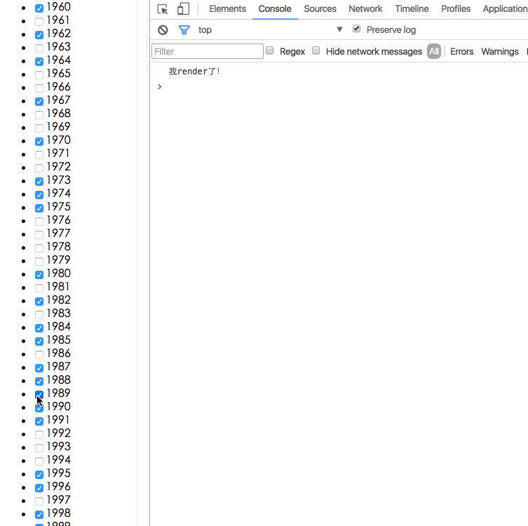

既然深拷贝能够解决问题 问什么还要引入 Immutable 呢？

深拷贝比较耗费性能和内存，甚至我们也可以通过在 shouldComponentUpdat较(需要写递归)解决上面的问题，但是这些做法都是不利于我们做性能Immutable 利用了一种叫做 Structural Sharing（结构共享）的技术，个节点发生变化，只修改这个节点和受它影响的父节点，其它节点则进行共享。表现了这一过程(图片来自网络)


### 方案三：PureComponent + Immutable.js

React 为我们提供了 PureComponent 纯组件来规避反复写 shouldComponentUpdate 来优化的问题

那么什么是纯组件呢？

如果我们的 React 组件的 render 函数在接收相同的 props 和 state 的情况下，能够渲染出同样的结果，我们称之为一个“纯”的组件，我们可以用 React.PureComponent 来进行优化，纯组件的概念实际上借用了函数式编程的概念。

代码方面我们只需把原来的 extend React.Component 改写为 React.PureComponent ，将 state 改为 Immutable 的数据即可，运行效果和方法二一样

通过Perf查看性能数据

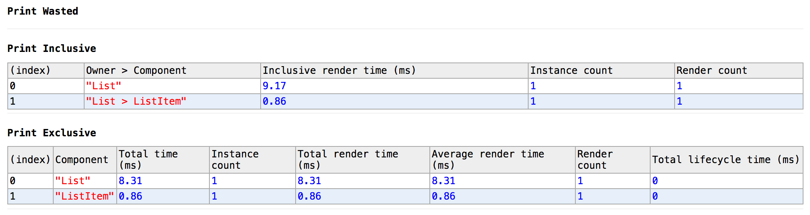

从上面的 React 中对比 props 和 state 处的代码中可以看出，当我们没有在组件中手动添加 shouldComponentUpdate 时，进入下面的 else 分支，利用 shallowCompare 进行比较，虽然 shallowCompare 是浅比较，但是借助于 Immutable 数据，我们只需比较前后 props 的引用即可

### 关于Immutable

在 [Immutable官网](https://github.com/facebook/immutable-js) 上打开 chrome 调试工具就可以调用 Immutable 的方法了

- Immutable 提供了几种不可变的数据类型，包括 List (对应数组)、Map (对应对象key-value)等，也有 fromJS 的方法,该方法可以把复杂的js对象“从里到外”全部变成不可变数据。也就是说，fromJS 与 Map 的区别就在于Map 只是对对象的第一层进行操作，里层嵌套的还是 js对象，而 fromJS 把对象中的 key-value 形式变成 Map，数组变成 List。对比效果如下图

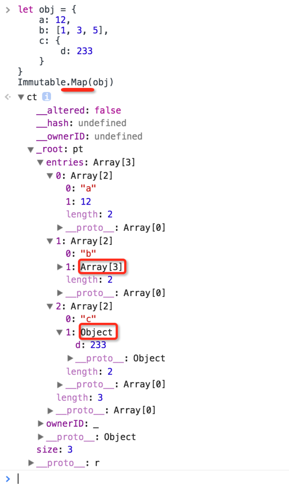
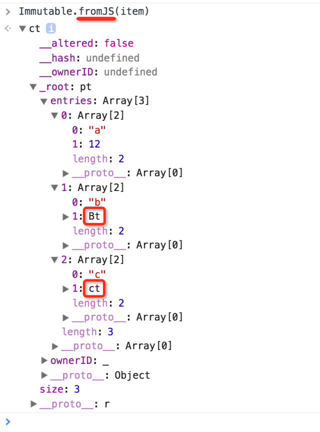

- 嵌套的不可变数据的取值方法

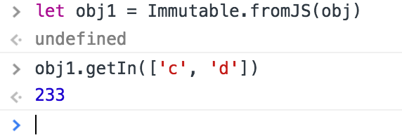

- 现有项目不建议引入，原因：(1) Immutable有一定的学习成本；(2) 改动较大，改动点较多；(3) PC 端目前并未暴露出使用性能上的问题

### 几点注意

- 避免在组件中传入不必要的多余的 props ，慎用 ...this.props，在尝试优化时，时常发现因为多余的props变化造成了重新render
- 注意 dom 节点的 key 属性的运用，有时不添加 key 可能会导致错误
- ...

### 总结

React 的 Virtual Dom 为我们提升了一部分的性能，就目前我们的 OA 系统使用情况，并没有发现有什么性能瓶颈，不确定的是在移动端的环境下，重复渲染是否会造成卡顿，经过一番调研，发现已经有一些团队已经在进行 React 的优化工作，并有了一些成型的优化方案，在了解了原理之后，我觉得优化思路实际上是比较多种多样的，我们可以引入 Immutable 解决问题，如果考虑到减包的问题( Immutable 压缩后有50k)，也已经有一些机智的程序员们写出了相对较小的 “Immutable“([seamless-immutable](https://github.com/rtfeldman/seamless-immutable)) ，甚至我们还可以自己造一个。
