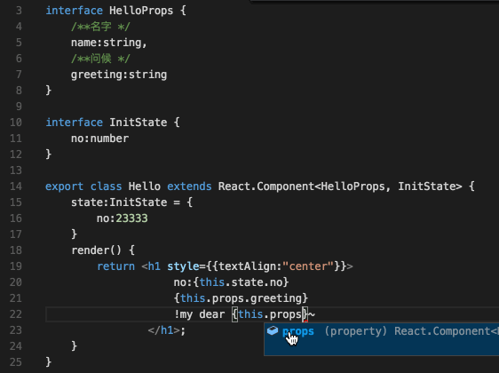

### 什么是 Typescript
Typescript 是微软开发的一款编程语言，是 Javascript 的*超集*

本质: 给 Javascript 添加静态类型系统

### 我们为什么想用 ts


例子
```js
 // 通过分数获取图标
function getRankIcon(score) {
  if(score >= 100) {
    return '';
  } else if(score >= 500) {
    return '';
  } else if(score >= 1500) {
    return '';
  }
}
const icon = getRankIcon(5);
// TypeError: Cannot read property 'split' of undefined
const iconArray = icon.split();
```

这种类型的错误，打包也不会报错，在线上接受数据时返回了 undefined ，就会造成错误出现，也可能造成损失。而ts可以帮助我们进行静态类型分析

```js
function getRankIcon(score: number):string {

 if(score >= 100) {
   return '';
 } else if(score >= 500) {
   return '';
 } else if(score >= 1500) {
   return '';

 }
}
const icon = getRankIcon(5);
const iconArray = icon.split();
```

### ts 的优点

- 为 Javascript 添加了静态类型系统，尽量避免不必要的错误，提早发现(在写的时候就能发现错误)
- 结合微软提供的 vs code 进行开发，智能提示提升效率



- 解决当前的项目文档建设问题，利用 ts 实现"代码就是文档"，甚至我们可以借助工具 typedoc 来为我们生成文档，方便快捷，即便队伍中加入了新成员，也能借助文档快速的理解代码的含义

```js
$ typedoc --out doc
Using TypeScript 2.1.6 from /usr/local/lib/node_modules/typedoc/node_modules/typescript/lib
Rendering [========================================] 100%

Documentation generated at /Library/WebServer/Documents/tryTS/doc
```

- 在后端改接口的情况下，快速响应

使用 @types/ 前缀表示我们额外要获取React和React-DOM的声明文件，智能提示，提升效率

```js
npm install --save react react-dom @types/react @types/react-dom
```

### ts 的缺点

- 无 OOP 经验的同学上手时间可能较长
- 没有 js 那样灵活，简洁(非常直观的一点就是代码量的增加)

### 关于编译

- 大多是减量的，只去掉声明类型的部分(除去enum、namespace等)
- 支持设置编译的目标(ES5/3)

### 编辑器

- Atom 插件: [atom-typescript](https://atom.io/packages/atom-typescript)
- Sublime Text 插件：[TypeScript-Sublime-Plugin](https://github.com/Microsoft/TypeScript-Sublime-Plugin)
- WebStorm 对 ts 的支持：[WebStrom-typescript](https://www.jetbrains.com/help/webstorm/2016.3/typescript-support.html)
- vs code: [vs code](https://code.visualstudio.com/)

### vs code 插件

- [docthis](https://marketplace.visualstudio.com/items?itemName=joelday.docthis) 用于快捷方便的生成注释
- [Json to Interface](https://marketplace.visualstudio.com/items?itemName=GregorBiswanger.json2ts) 一键 Json 转化为 Interface插件
- [icons](https://marketplace.visualstudio.com/items?itemName=robertohuertasm.vscode-icons) 为 vs code 添加文件类型图表
- [vscode-background](https://github.com/shalldie/vscode-background) 自定义背景(~~想让漂亮的小姐姐看你写代码吗~~(*≧▽≦*))

### 实例

- [React + Redux + Typescript 实现的 Todo App](https://github.com/ZhangXinmiao/Todo)
- 蚂蚁金服组件库 [ant-design](https://github.com/ant-design/ant-design/)   
