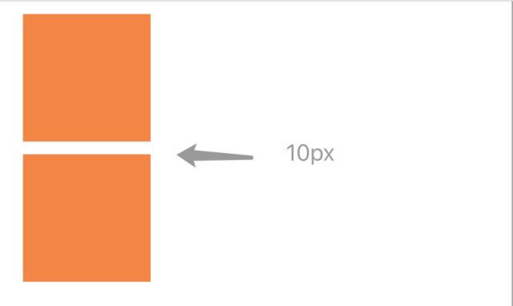
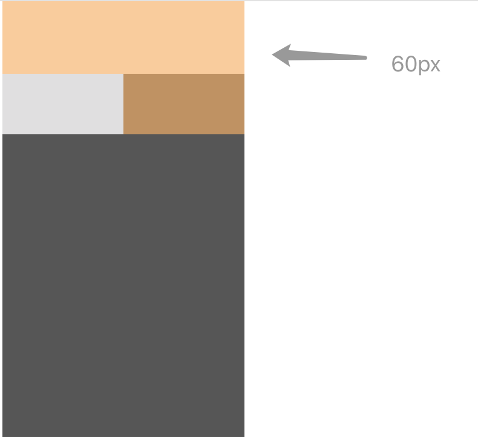
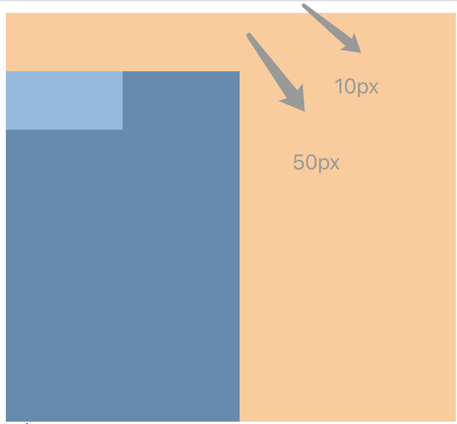

#### 相邻兄弟元素的margin重叠(垂直方向)

##### code
```html
<!doctype html>
<html>
	<head>
		<title>dealwithword</title>
		<style>
			div {
				margin: 10px;
				width: 100px;
				height: 100px;
				background-color: RGB(245, 133, 59);
			}
		</style>
	</head>
	<body>
		<div></div>
		<div></div>
	</body>
</html>

```

##### performance



按照预想，两个div之间应该有20px的空隙才对，但是实际上，这里只有10px

#### 父元素和第一个子元素

##### code
```html
<!doctype html>
<html>
	<head>
		<title>dealwithword</title>
		<style>
			#father {
				width: 200px;
				height: 300px;
				background-color: RGB(86, 86, 86);
				margin-top: 50px;				
			}

			#first-son {
				width: 100px;
				height: 50px;
				background-color: RGB(224, 223, 224);
				margin-top: 60px;
			}
		</style>
	</head>
	<body>
		<div id="father">
			<div id="first-son"></div>
		</div>
	</body>
</html>

```

##### performance



