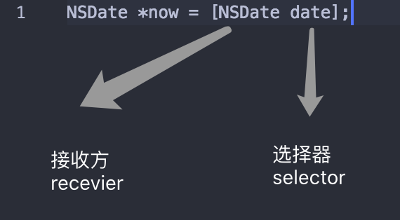
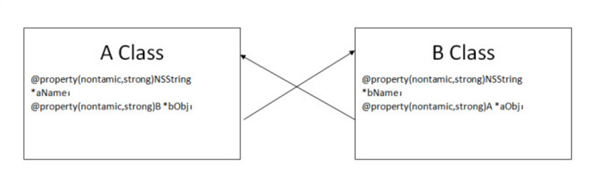
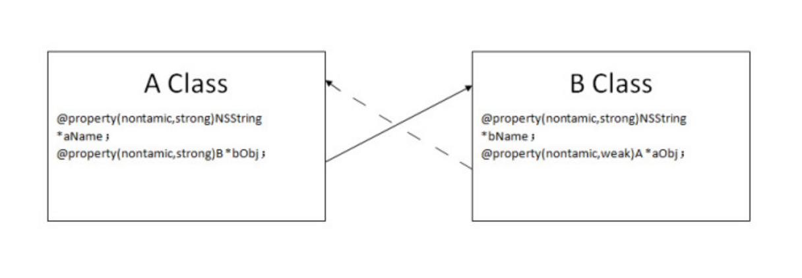

### 关于对象

#### 对象和消息

- 一个对象可以保存多个相关的数据，在对象中这些数据称为**实例变量**。
- Xcode 在创建新项目时会自动导入Foundation框架，提供许多基础类，iOS 以 及 OS X 应用都要使用这些基础类。在 main.m 中可以看到这样的代码：
```Objective-C
// include 与 import 的区别是：include仅是复制粘贴；而 import 则会让编译器检查是否已经引用过该文件
#import <Foundation/Foundation.h>
```
- 如需执行方法中的代码，首先要发送一条**消息**给包含这个方法的对象或类。
```Objective-C
//像 NSDate 类发送 date 消息，执行 date 方法
NSDate *now = [NSDate date];
```
  
- 方法允许传入一个或多个实参
- nil——不指向任何对象的指针，在 Objective-C 中 nil 是值为0的指针而且允许向 nil 发送消息，但什么也不会发生
- 在声明指向对象的指针时，通常会写出相应对象的类。在编写程序时，可能遇到不知道指针的准确类型，这时可以使用 **id** 类型——可以指向任意类型 OC 对象的指针
```Objective-C
// 此处没有使用星号，因为 id 已经隐含了星号的作用
id now;
```

#### 对象与内存

- 自动销毁不被引用的对象的机制称为 **ARC**（automatic reference counting）——每个对象都会对指向自己的指针进行计数，一旦引用数为 0，程序将自动销毁改对象
- 当不再需要某个对象的时候，可将它的指针设置为 nil

### 关于类

#### 类

- 项目中 .h 文件为**头文件**，用于实例变量和方法的声明；.m 文件为**实现文件**，包含方法的代码实现
- 实例变量一般以_下划线为开始，使用下划线前缀可以分辨实例变量和局部变量
- 对于实例变量，取方法应为实例变量名去掉下划线；存方法则是实例变量去掉下划线后在前面加上 set
- 由于 Objective-C 中没有命名空间的概念，以防在引入第三方库的时候造成冲突，一般在自己编写的类名前加上大写字母的前缀
- Objective-C 中的方法都包含一个 **self** 局部变量，self 为指向运行当前方法的对象的**指针**

#### 属性

- 属性以 `@property` 开始，后面是属性的类型和名称。声明属性使类的声明更加简洁，减少许多代码的编写

```Objective-C
- @property (nonatomic) float height;
```
- 在代码中声明的属性的情况下，无需再进行存取方法的编写，因为编译器会根据声明的属性进行存取方法的实现
- 用 `.` 也可以调用存取方法

#### 类继承

- 子类继承父类的实例变量和方法
- 子类中可以**覆盖**（override）自父类的方法
- 覆盖方法时，子类可通过 `super` 得到父类的实现

```Objective-C
- (float) bodyMassIndex {
	float noramlBMI = [super bodyMassIndex];
	return noramlBMI * 0.97;
}
```
- 当某个对象接收到了某消息，收到的对象将沿着继承链进行查询该方法，直到找到该方法或者一直到继承链的顶端也没有找到，程序将报错

#### 类扩展

- 类扩展一般添加在类实现文件中，可在类扩展中声明属性

```Objective-C
@interface BNREmployee ()

@property (nonatimoc) unsigned int officeAlamCode;

@end
@implementation BNREmployee
...
```
- 类扩展内声明的属性只能在类内使用，类外不可获取，为**私有变量**
- 类扩展内科声明私有实例变量
- 利用扩展类可添加**私有方法**——在扩展中声明方法并在实现文件中实现即可
- 子类无法获取父类的类扩展

#### 强引用与弱引用

- A 对象拥有 B 对象，而 B 对象又同时拥有 A 对象，这种互相拥有的所有权关系导致相关对象都无法被释放，这种情况被称之为**强引用循环**，强引用循环是导致内存泄漏的常见原因

  

- **弱引用**可以解决强引用循环问题，具体方法是将双方引用中的一方在声明时添加 `weak`

```Objective-C
@property (nonatimoc, weak) BNREmployee *holder;
```
  

### Block 对象

- 认识 Block 对象，下面是一段 Block 对象代码
```Objective-C
^ {
	NSLog(@"this is a block");
}
```
- 声明 Block 变量时，要给出 Block 对象的返回值以及实参类型
```Objective-C
void (^devowelizer)(id, NSUIInteger, Bool*)
```
- 当 Block 对象有返回值时，可像调用函数一样调用该对象
```Objective-C
double (^divBlock) (double, double);

    divBlock = ^(double dividend, double divisor) {
        double quotient = dividend / divisor;
        return quotient;
    };

    __unused double result = divBlock(1.2, 3.6);
```
- 在 Block 对象中需要使用 self 时需注意的是，在 A 实例中的 Block对象如果使用了 self，就造成了强引用循环，解决的方法是在 Block 对象外声明一个 `_weak` 指针，然后通过指针去获取 self，这样就打破了强引用循环

```Objective-C
_weak A *weakSelf = self;
myBlock = ^{
	...
}
```
