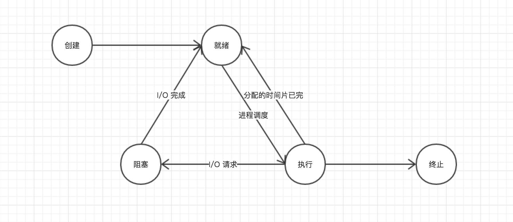

### 操作系统的主要功能

### 关于进程
#### 进程的三个基本状态

- 就绪状态（Ready）：进程已处于准备好运行的状态。如系统中有许多处于就绪状态的进程，这些进程将会被按照一定的策略排成一个队列，我们把该队列称之为**就绪队列**
- 执行状态（Running）：进程已获得CPU，该程序正在执行的状态
- 阻塞状态（Block）：进程的执行受到阻塞。系统将处于阻塞状态的进程也排列成一个队列，我们把该队列称之为**阻塞队列**

#### 另外两种常见的状态

- 创建状态：包括申请空白PCB、为进程分配资源等，保证进程的调度是必须在创建工作完成后进行，以确保对进程控制块操作的完整性。
- 终止状态：包括将PCB清零并将PCB空间返还系统等。

#### 五种基本状态之间的转换关系

#### 进程的通信类型

高级通信机制可分为四种：
- 共享存储器系统（Shared-Memory System）：相互通信的进程共享某些数据结构或共享存储区。
- 管道（pipe）通讯系统：“管道”是指用于连接一个读进程和一个写进程以实现它们之间通信的一个共享文件，又名pipe文件。向管道提供输入的发送进程以**字符流**的形式将大量数据送入管道；而接进程则从管道中接收数据，故称为**管道通信**。这种方式首创于UNIX系统，由于能够有效的传送大量数据，也被引入到其他的操作系统之中。
- 消息传递系统（Message passing system）：以格式化的消息（message）为单位，将通信的数据封装在消息中，利用操作系统的原语在进程间进行消息传递。
- 客户机-服务器系统（Client-server system）：主流通信机实现机制，只要方法分为三类：套接字、远程过程调用以及远程方法调用。
