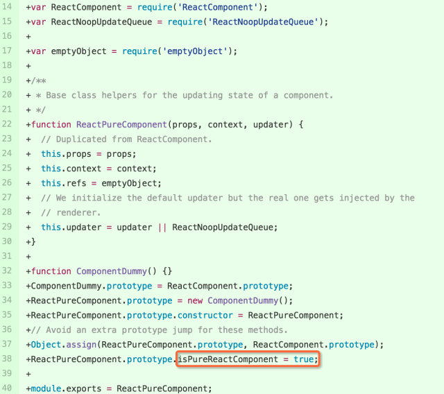

### PR

添加 PureComponent 部分的 [pr](https://github.com/facebook/react/pull/7195/commits/aab1fd6e6af43aacb36f2e2006d3fc9245e064ec)

### 分析

先大体看一下这次的pr都做了些什么事情

- 增加 ReactPureComponent 类文件
- ReactPureComponent 的测试文件
- ReactCompositeComponent.js 文件的改动

这里重点看一下第一点和第三点

### ReactPureComponent.js 文件

### ReactCompositeComponent.js 的改动

")

")

")

")

- 31-36行 增加了CompositeTypes对象，这里重点注意ImpureClass值为0，PureClass值为1

- 100-101行 增加了isPureComponent方法，注意isPureReactComponent属性在ReactPureComponent初始化时值设置为1

- 235-241行 这里对isPureComponent 值进行判断，设置_compositeType的值

- 873-876行 当this._compositeType与CompositeTypes.PureClass相等时，利用shallowEqual比较props和state的先后变化

### 总结

经过上面的分析，可以认为当我们的一个组件继承了React.PureComponent类时，React内部会帮我们做一次对props和state的比较，如果二者其一发生变化，组件重新render，所以我们称这个组件为一个纯组件。React.PureComponent 让我们不必重复的写ComponentShouldUpdate 方法。
