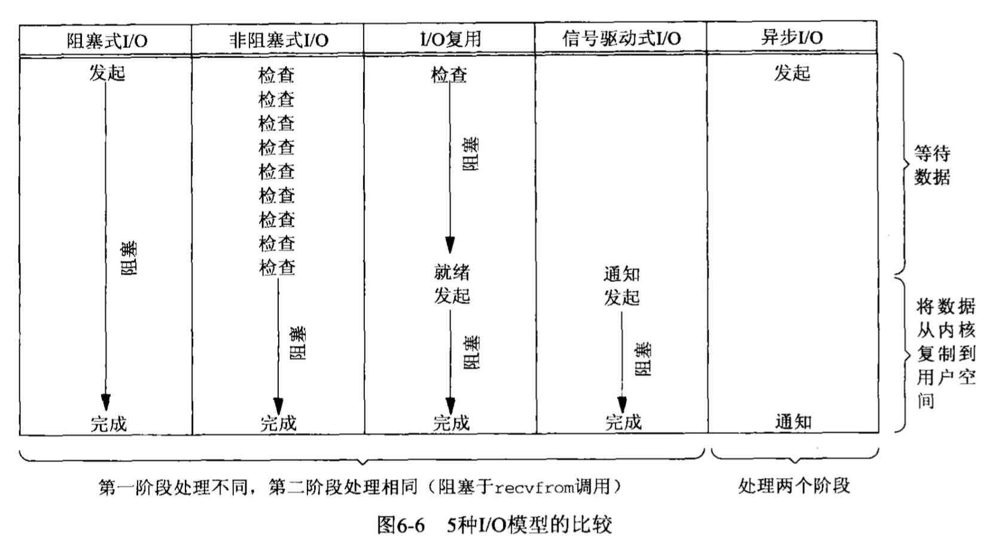

#### 并发服务器

在同时又大量的客户连接到同一服务器上时用于提供并发性的一种常用 Unix 技术。每个客户连接都迫使它派生（fork）一个新的进程。

#### fork 函数和 exec 函数

##### fork 函数

fork 函数：派生性进程的唯一方法

重点理解：fork 函数调用**一次**，他却返回**两次**，它在调用进程（也就是父进程）中返回一次，返回值是新派生进程（也就是子进程），在子进程中又返回一次，返回值为0。这样，返回值本身就告诉我们是父进程还是子进程。

子进程返回0的原因：任何子进程只有一个父进程，子进程总是可以通过调用 getppid 来获取父进程的进程 id 号，相反，父进程却又多个子进程，而且无法获取各个子进程的 id，如果父进程想要跟踪子进程的 id，那么它必须记录每次返回的子进程 id。

fork 函数的两个经典用法：

- 一个进程创建自身的一个副本，这样每个副本都可以在另一个副本执行其他任务的同时处理各自的某个操作。
- 一个进程想要执行另一个程序，该进程首先调用 fork 创建一个自身的副本，调用 exec 把自身替换成新的程序文件，进程 id 并不改变。我们称调用 exec 的进程为调用进程（calling process），称新执行的程序为新程序（new program）。

##### exec 函数

exec 函数：放在硬盘上的可执行程序文件能够被 unix 执行的唯一方法是：由一个现有进程调用六个 exec 中的某一个，这六个函数被统称为 exec 函数。

##### socket 函数

为了执行网络 I/O ，一个进程必须做的第一件事就是调用 socket 函数，指定期望的通信协议类型

##### I/O 模型

Unix 下可用的5种 I/O 模型：

- 阻塞式 I/O
- 非阻塞式 I/O
- I/O 复用（multiplexing）
- 信号驱动式 I/O
- 异步 I/O

