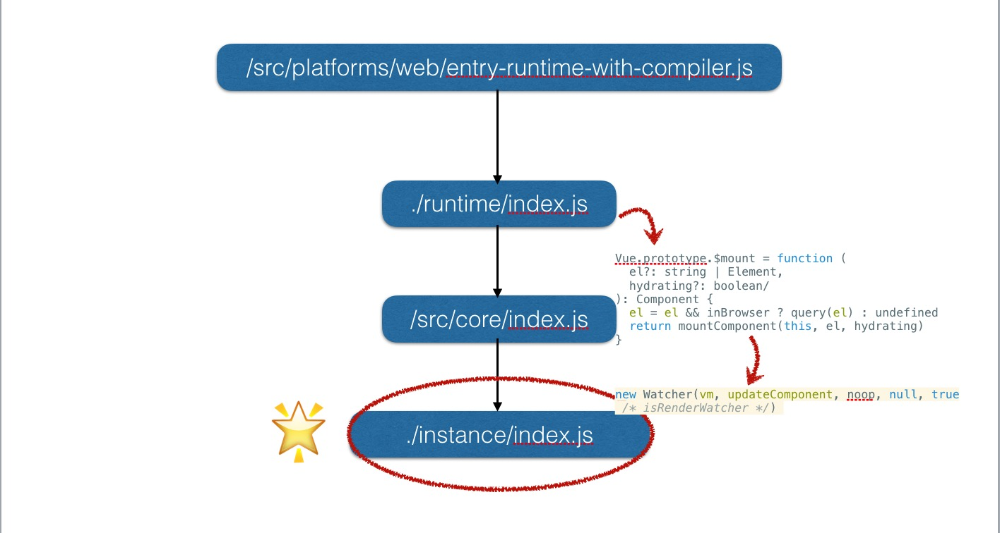
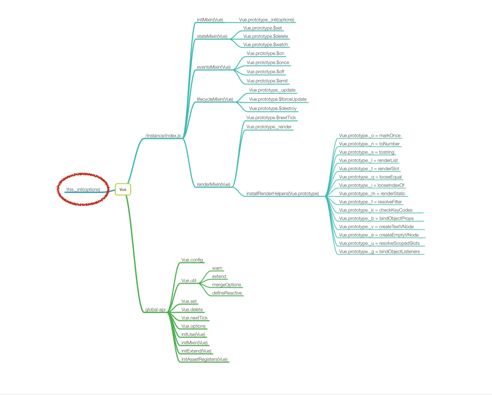
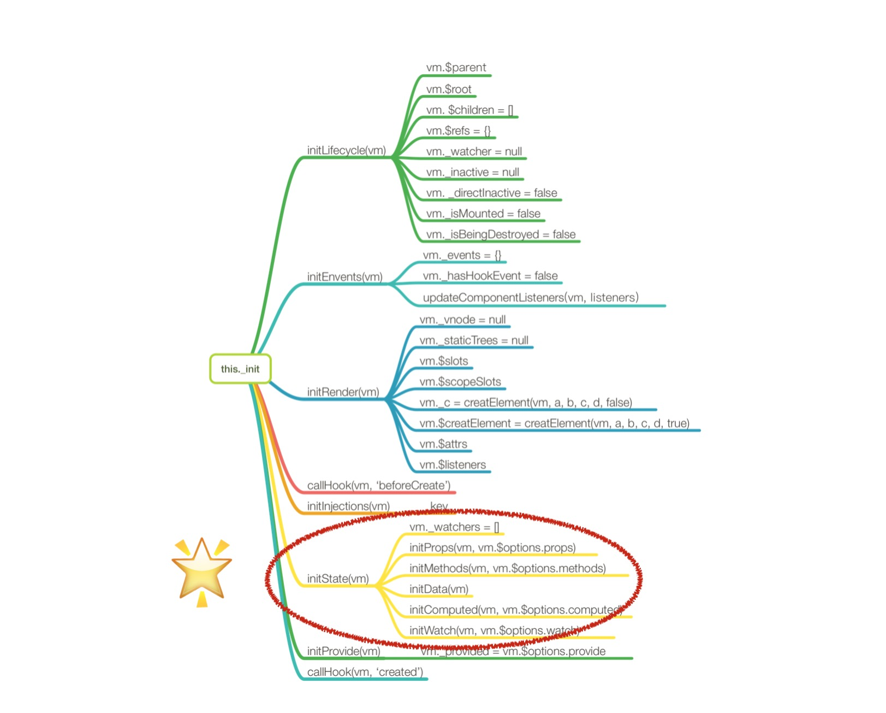
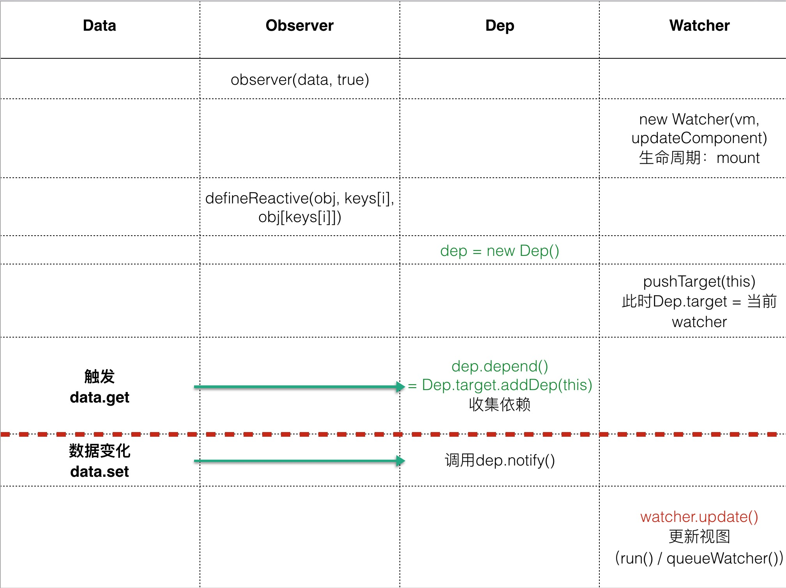

### 项目结构

> 译自https://github.com/vuejs/vue/blob/dev/.github/CONTRIBUTING.md的 Project Structure 部分

- script: 包含构建相关的脚本和配置文件，在大多数情况下无需去了解。然而，在你自己了解一下的文件时将变得十分有帮助
	- script/alias.js: 导出所有源代码和测试文件中用到的别名的模块
	- script/config.js: 包含所有在dist/中的文件的构建配置。如果想要找到dist文件的源代码入口文件可以检查这个文件
- dist: 包含用于分发的构建文件，注意这个目录词语在发布的时候才会更新
- flow: 包含 Flow 的类型声明，这些声明在全局被加载并且你可以看到他们在源代码的类型注释中
- packages: 包含 vue-server-renderer 和 vue-template-compiler，是作为单独的 npm 包发布的，他们由源代码自动的生成且通常和主要的vue包有着相同的版本
- test: 包含所有的测试，单元测试是用 Jasmine 框架编写的；用 Karma 框架跑的， e2e测试是为Nightwatch.js编写和运行的。
- src: 很明显，包含源代码，代码标准是 ES2015 类型注释是 Flow
	- compiler: 包含编译 template-to-renderer-function 的代码
	- core: 包含通用的、平台无关的运行时代码
		- observer: 包含与响应系统相关的代码
		- vdom: 包含与创建 vdom 元素和 patch 相关的代码
		- instance: 包含 Vue 实例 constructor 和原型方法
		- global-api: 全局api
		- components: 通用抽象组件，目前只有 keep-alive一个
	- server: 包含服务器端渲染的相关代码
	- platforms: 包含平台特定的代码
	- sfc: 包含单文件组件分析逻辑，在 vue-template-compiler 包中有用到
	- shared:
	- types: 包含 typescript  类型定义
		- test: 类型定义测试


### Vue 构造函数

#### 从 package.json 入手

```javascript
"dev": "rollup -w -c scripts/config.js --environment TARGET:web-full-dev"
```

#### 按部就班的查找线索

那么就去找到 config.js 找到配置文件中的入口与出口

```javascript
// Runtime+compiler development build (Browser)
'web-full-dev': {
  entry: resolve('web/entry-runtime-with-compiler.js'),
  dest: resolve('dist/vue.js'),
  format: 'umd',
  env: 'development',
  alias: { he: './entity-decoder' },
  banner
},
```

可以看到 entry入口文件打包后就是vue.js 直接去找 /src/platforms/web/entry-runtime-with-compiler.js文件

找到该文件 可以看到引入了这个文件./runtime/index

下图是梳理过的文件引用关系：



instance/index.js 文件中就是Vue最初声明的地方了，代码如下

```javascript
import { initMixin } from './init'
import { stateMixin } from './state'
import { renderMixin } from './render'
import { eventsMixin } from './events'
import { lifecycleMixin } from './lifecycle'
import { warn } from '../util/index'

function Vue (options) {
  if (process.env.NODE_ENV !== 'production' &&
    !(this instanceof Vue)
  ) {
    warn('Vue is a constructor and should be called with the `new` keyword')
  }
  this._init(options)
}

initMixin(Vue)
stateMixin(Vue)
eventsMixin(Vue)
lifecycleMixin(Vue)
renderMixin(Vue)

export default Vue
```
这段代码中引入了一些依赖的函数，并且在这里 Vue 实例被挂载了方法和属性并导出到 /src/core/index.js 中继续被处理

以下是/src/core/index.js文件

```javascript
import Vue from './instance/index'
import { initGlobalAPI } from './global-api/index'
import { isServerRendering } from 'core/util/env'

initGlobalAPI(Vue)

Object.defineProperty(Vue.prototype, '$isServer', {
  get: isServerRendering
})

Object.defineProperty(Vue.prototype, '$ssrContext', {
  get () {
    /* istanbul ignore next */
    return this.$vnode && this.$vnode.ssrContext
  }
})

Vue.version = '__VERSION__'

export default Vue
```

5行 initGlobalAPI(Vue) Vue被作为参数传入initGlobalAPI方法中

7、11行 分别给Vue.prototype挂载$isServer和$ssrContext属性

18行 最后 给Vue对象添加version版本属性

到现在，Vue已经具有了一下的方法和属性



此时可以看看 Vue.prototype._init(option)函数究竟做了什么


梳理结果如下



### 响应式原理

在答题了解了 Vue 的初始化过程都做了哪些工作后，终于可以接近响应式原理了(激动)

在上一张图的红圈部分需要格外注意的是 initState(vm) 方法

```javascript
export function initState (vm: Component) {
  vm._watchers = []
  const opts = vm.$options
  if (opts.props) initProps(vm, opts.props)
  if (opts.methods) initMethods(vm, opts.methods)
  if (opts.data) {
    initData(vm)
  } else {
    observe(vm._data = {}, true /* asRootData */)
  }
  if (opts.computed) initComputed(vm, opts.computed)
  if (opts.watch && opts.watch !== nativeWatch) {
    initWatch(vm, opts.watch)
  }
}
```

这段代码的重点是 7 行的 initData(vm) 函数 找到该函数 可以看到关键的一句代码

```javascript
observe(data, true /* asRootData */)
```

这里的 observe 函数中 实例化了一个 Observe 类，这个类就是 Vue 实现响应式原理的三个重要的类之一(Observe、Dep、Watcher)

首先找到 Observe 类，去看看他里面实现的是什么样的功能

```javascript
/**
 * Observer class that are attached to each observed
 * object. Once attached, the observer converts target
 * object's property keys into getter/setters that
 * collect dependencies and dispatches updates.
 */
export class Observer {
  value: any;
  dep: Dep;
  vmCount: number; // number of vms that has this object as root $data

  constructor (value: any) {
    this.value = value
    this.dep = new Dep()
    this.vmCount = 0
    def(value, '__ob__', this)
    if (Array.isArray(value)) {
      const augment = hasProto
        ? protoAugment
        : copyAugment
      augment(value, arrayMethods, arrayKeys)
      this.observeArray(value)
    } else {
      this.walk(value)
    }
  }

  /**
   * Walk through each property and convert them into
   * getter/setters. This method should only be called when
   * value type is Object.
   */
  walk (obj: Object) {
    const keys = Object.keys(obj)
    for (let i = 0; i < keys.length; i++) {
      defineReactive(obj, keys[i], obj[keys[i]])
    }
  }

  /**
   * Observe a list of Array items.
   */
  observeArray (items: Array<any>) {
    for (let i = 0, l = items.length; i < l; i++) {
      observe(items[i])
    }
  }
}
```

walk函数中对data进行遍历，调用defineReactive函数；defineReactive接受object、key以及value作为参数

defineReactive函数代码

```javascript
/**
 * Define a reactive property on an Object.
 */
export function defineReactive (
  obj: Object,
  key: string,
  val: any,
  customSetter?: ?Function,
  shallow?: boolean
) {
  const dep = new Dep()

  const property = Object.getOwnPropertyDescriptor(obj, key)
  if (property && property.configurable === false) {
    return
  }

  // cater for pre-defined getter/setters
  const getter = property && property.get
  const setter = property && property.set

  let childOb = !shallow && observe(val)
  Object.defineProperty(obj, key, {
    enumerable: true,
    configurable: true,
    get: function reactiveGetter () {
      const value = getter ? getter.call(obj) : val
      if (Dep.target) {
        dep.depend()
        if (childOb) {
          childOb.dep.depend()
          if (Array.isArray(value)) {
            dependArray(value)
          }
        }
      }
      return value
    },
    set: function reactiveSetter (newVal) {
      const value = getter ? getter.call(obj) : val
      /* eslint-disable no-self-compare */
      if (newVal === value || (newVal !== newVal && value !== value)) {
        return
      }
      /* eslint-enable no-self-compare */
      if (process.env.NODE_ENV !== 'production' && customSetter) {
        customSetter()
      }
      if (setter) {
        setter.call(obj, newVal)
      } else {
        val = newVal
      }
      childOb = !shallow && observe(newVal)
      dep.notify()
    }
  })
}
```

可以看到，defineReactive主要的工作是将data的属性转换为访问器属性

getter方法中的dep.depend()是在添加监听

setter方法中的dep.notify就是在更新视图


在这里可以看到 出现了Dep 类

具体看 Dep 的声明代码

```javascript
/* @flow */

import type Watcher from './watcher'
import { remove } from '../util/index'

let uid = 0

/**
 * A dep is an observable that can have multiple
 * directives subscribing to it.
 */
export default class Dep {
  static target: ?Watcher;
  id: number;
  subs: Array<Watcher>;

  constructor () {
    this.id = uid++
    this.subs = []
  }

  addSub (sub: Watcher) {
    this.subs.push(sub)
  }

  removeSub (sub: Watcher) {
    remove(this.subs, sub)
  }

  depend () {
    if (Dep.target) {
      Dep.target.addDep(this)
    }
  }

  notify () {
    // stabilize the subscriber list first
    const subs = this.subs.slice()
    for (let i = 0, l = subs.length; i < l; i++) {
      subs[i].update()
    }
  }
}

// the current target watcher being evaluated.
// this is globally unique because there could be only one
// watcher being evaluated at any time.
Dep.target = null
const targetStack = []

export function pushTarget (_target: Watcher) {
  if (Dep.target) targetStack.push(Dep.target)
  Dep.target = _target
}

export function popTarget () {
  Dep.target = targetStack.pop()
}
```

notify 方法就是在执行后续的改变了，他向订阅者发布消息，从而驱动视图更新

这样 可以得出：getter方法中的dep.depend()是在添加监听，setter方法中的dep.notify就是在更新视图了

*存疑：Dep.target 的作用是什么呢，为什么判断完他的值之后把null赋值给他了呢*

订阅者则是 watcher —— /core/observer/watcher.js（简化后的代码)

```javascript
export default class Watcher {
	this.getter = expOrFn

	get () {
		pushTarget(this)
		value = this.getter.call(vm, vm)
		popTarget()
		this.cleanupDeps()
	}
}
```

Dep相当于一个中转，去添加和删除“依赖”，在Watcher中，首先调用getter去添加依赖，在数据发生改变时，就会自动的调用回调函数。

#### 总结

根据以上的分析，可以根据以下的表格来理解(按照时序)


